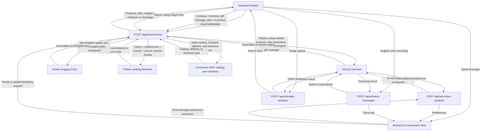

# GenieAI API

Concise HTTP reference for the public API routes.

## Overview

| Method | Endpoint | Purpose |
|---|---|---|
| `POST` | `/api/ai/chatbot` | Multilingual shopping chat |
| `POST` | `/api/ai/context-analysis` | Extract shopping preferences from text |
| `POST` | `/api/ai/image-analysis` | Analyze an image for product-search hints |
| `POST` | `/api/ai/voice-messages` | Transcribe English audio |
| `POST` | `/api/ai/commerce` | Search, compare, plan, generate gift messages, and check out |

Use your deployed application origin as the base URL:

```text
{BASE_URL}/api/ai/...
```

## Conventions

- JSON endpoints require `Content-Type: application/json`.
- Upload endpoints require `multipart/form-data`. Let the HTTP client set the boundary.
- All responses are JSON.
- Supported languages: `English`, `Sinhala`, and `Singlish`.
- Commerce prices use `LKR`; dates use `YYYY-MM-DD`.
- Incoming requests are currently unauthenticated.

Most errors use:

```json
{ "error": "Human-readable message" }
```

## Chatbot

`POST /api/ai/chatbot`

Returns one short shopping-assistant reply.

### Request

```json
{
  "selectedLanguage": "English",
  "messages": [
    { "role": "user", "content": "How do I choose a birthday gift?" }
  ]
}
```

| Field | Type | Required | Notes |
|---|---|---:|---|
| `messages` | array | Yes | Final 10 valid messages. Roles: `system`, `user`, `assistant`. At least one user message is required. |
| `selectedLanguage` | string | No | Defaults to `English`. `language` is accepted as a legacy alias. |

### Response — `200`

```json
{
  "reply": "Start with the recipient's interests and your budget.",
  "model": "openai/gpt-oss-120b"
}
```

Errors: `400` for no valid user message, `500` for missing provider credentials, and upstream/`502` errors for generation failures.

## Context analysis

`POST /api/ai/context-analysis`

Extracts shopping preferences from the latest user message. Existing context fills details not mentioned in the new message.

### Request

```json
{
  "message": "I need flowers for my wife's birthday under Rs. 5000",
  "selectedLanguage": "English",
  "context": {
    "budget": null,
    "category": null,
    "occasion": null,
    "recipient": null
  }
}
```

| Field | Type | Required | Notes |
|---|---|---:|---|
| `message` | string | Yes | Latest user message. |
| `selectedLanguage` | string | No | Defaults to `English`. |
| `context` | object | No | Existing `budget`, `category`, `occasion`, and `recipient`. |

### Response — `200`

```json
{
  "budget": "Rs. 2,500 - 5,000",
  "category": "Flowers",
  "detectedLanguage": "English",
  "occasion": "Birthday",
  "recipient": "Female",
  "requestedGiftType": null,
  "missingFields": []
}
```

Normalized values:

- `budget`: `Under Rs. 2,500`, `Rs. 2,500 - 5,000`, `Rs. 5,000 - 10,000`, `Above Rs. 10,000`, `Other`, or `null`
- `category`: `Flowers`, `Cakes`, `Chocolate`, `Perfumes`, `Fashion`, `Other`, or `null`
- `occasion`: `Birthday`, `Anniversary`, `Wedding`, `Graduation`, `Other`, or `null`
- `recipient`: `Male`, `Female`, `Child`, `Couple`, `Other`, or `null`

Without AI credentials, this endpoint still returns `200` using local analysis and includes a `warning` field. It returns `400` when `message` is empty.

## Image analysis

`POST /api/ai/image-analysis`

Analyzes an image and returns product-search hints.

### Request

Send `multipart/form-data` with one field:

| Field | Type | Required | Limit |
|---|---|---:|---:|
| `image` | file | Yes | 4 MiB |

### Response — `200`

```json
{
  "summary": "A bouquet of red roses wrapped for gifting.",
  "labels": [
    { "label": "red roses", "score": 0.98 },
    { "label": "bouquet", "score": 0.95 }
  ],
  "visibleText": [],
  "productHints": ["rose bouquet", "anniversary flowers"],
  "searchQuery": "red rose bouquet",
  "model": "qwen/qwen3.6-27b"
}
```

If vision is temporarily unavailable, the endpoint may return `200` with `"fallback": true` and filename-based search hints.

Errors: `400` for a missing file, `413` above the size limit, `500` for missing credentials, and upstream/`502` errors for analysis failures.

## Voice transcription

`POST /api/ai/voice-messages`

Transcribes English speech. It does not generate audio.

### Request

Send `multipart/form-data`:

| Field | Type | Required | Value/limit |
|---|---|---:|---|
| `audio` | file | Yes | Maximum 12 MiB |
| `language` | string | Yes | Must be `en` |

### Response — `200`

```json
{
  "language": "en",
  "model": "whisper-large-v3-turbo",
  "transcript": "Find a birthday cake under five thousand rupees."
}
```

Unclear or non-English audio returns `422`:

```json
{
  "error": "We couldn't clearly recognize that voice message. Please try again in English.",
  "model": "whisper-large-v3-turbo",
  "retry": true
}
```

Other errors: `400` for invalid fields, `413` above the size limit, `415` for the wrong content type, and `500` for missing credentials.

## Commerce

`POST /api/ai/commerce`

A task-based endpoint for the live GenieAI catalog.

### Tasks

| Task | Purpose | Key input |
|---|---|---|
| `initial` | Load initial products | `query` |
| `recommend` | Search and recommend products | `query`, `userMessage`, preferences |
| `eventPlan` | Create an event checklist without ranking products | `eventUserPreference` |
| `giftBox` | Create a gift-box list without ranking products | `giftUserPreference` |
| `compare` | Compare live products and generate scored AI insights | `productIds` |
| `checkout` | Create a guest-checkout link | `cartIds`, `profile`, `checkout` |
| `giftMessage` | Generate a gift-card message | `giftMessagePreferences` |

`task` defaults to `recommend`.

Order tracking has been removed. Sending `"task": "track"` or any other unsupported task returns `400` with `{"error":"Unsupported commerce task."}`.

### Common request

```json
{
  "task": "recommend",
  "mode": "Smart Shopping",
  "language": "English",
  "query": "birthday flowers",
  "userMessage": "Find flowers for my wife under Rs. 5000",
  "cartIds": [],
  "productIds": [],
  "conversationHistory": [],
  "profile": {
    "budget": "Rs. 2,500 - 5,000",
    "category": "Flowers",
    "city": "Colombo",
    "date": "2026-09-01",
    "occasion": "Birthday",
    "recipient": "Female"
  },
  "extendedPreferences": {
    "budget": "Rs. 2,500 - 5,000",
    "giftType": "Flowers",
    "occasion": "Birthday",
    "recipient": "Female"
  }
}
```

| Field | Type | Notes |
|---|---|---|
| `task` | string | Defaults to `recommend`. |
| `mode` | string | Common values: `Smart Shopping`, `Event Planner`, `Gift Box Builder`, `Product Compare`, `Gift Message`. |
| `language` | string | Defaults to `English`. |
| `query` | string | Search text or task input. |
| `userMessage` | string | Exact conversational message; defaults to `query`. |
| `profile` | object | `budget`, `category`, `city`, `date`, `occasion`, `recipient`. |
| `extendedPreferences` | object | `budget`, `giftType`, `occasion`, `recipient`. |
| `eventUserPreference` | object | Preferences for Event Planner. |
| `giftUserPreference` | object | Preferences for Gift Box Builder. |
| `events` | array | Buffered interaction events attached only to recommendation requests. Accepted events are `search`, `impression`, `view`, `compare`, `add_to_cart`, `remove_from_cart`, and `purchase`; at most 100 are forwarded. |
| `cartIds` | string[] | Up to 30 product IDs; required for checkout. |
| `productIds` | string[] | Two IDs are required by the current UI comparison flow. The API parses up to 3 IDs. |
| `conversationHistory` | array | Final 3 valid user/assistant messages. |
| `preserveProfile` | boolean | Keep submitted profile values when `true`. |

### Common response — `200`

```json
{
  "mode": "Smart Shopping",
  "reply": "I found options that fit your request.",
  "detectedLanguage": "English",
  "products": [],
  "recommendations": [],
  "comparisonInsights": [],
  "chips": ["Suggest more"],
  "delivery": null,
  "eventPlan": [],
  "giftMessage": "",
  "analytics": {
    "buyBoxHealth": "Ranked live products ready",
    "conversionSignal": "Active shopping request",
    "nextBestAction": "Review the recommended cards",
    "risk": "Price and stock can change"
  }
}
```

Products include `id`, `name`, `imageUrl`, `category`, `price`, `currency`, `stock`, `stockLabel`, `description`, and `url`; live products may also include `apiDetails`. Recommendations include `id`, `fitScore` (`0–100`), and `reason`. Product-search responses expose up to 12 products in ranked order and up to four recommendation explanations. The frontend shows ranks 1–4 initially, 5–8 after the first Suggest more click, and 9–12 after the second. Suggest more does not call or rerank through the API; its third click returns no products and prompts the user to change the query or preferences.

### Guided Event and Gift Box budgets

Guided modes use two ordered requests. The `eventPlan` or `giftBox` request first
generates only the item plan and returns no products. Next.js retains that plan,
the current item index, and the active mode. It then sends a `recommend` request
for only the current item's search term and category; the Python payload does not
receive the frontend mode or the complete plan.

In the GenieAI frontend, a budget selected for Event Planner or Gift Box Builder
is the total budget for the whole plan, not a budget for every item. The initial
guided-plan request retains that total. Each subsequent item-card search divides
the total before calling this endpoint and sends the per-item amount in both
`profile.budget` and the mode-specific preference object:

- Event Planner divides by the number of guided plan items.
- Gift Box Builder divides by the selected item count.

For example, a total budget of `Rs. 10,000` across four items results in an
individual search budget of `Under Rs. 2,500`. Direct API clients implementing
guided item searches should apply the same calculation; the API filters products
using the budget supplied in the individual request.

### Compare

The product-card workflow selects exactly two products:

1. Click **Compare** on a product image.
2. Other product cards remain visible and their action changes to **Select**.
3. Select one more product.
4. Click **Done (2/2)** in the chat header. The UI switches to the Product Compare tab and sends the two selected IDs to this task.

The comparison page does not expose product-ID fields. It displays only each product's name, price, full description, and AI insights.

```json
{
  "task": "compare",
  "mode": "Product Compare",
  "language": "English",
  "productIds": ["PRODUCT_ID_1", "PRODUCT_ID_2"]
}
```

At least two valid product IDs are needed for the exact comparison flow. Unavailable products are omitted. If fewer than two products resolve, the endpoint returns `200` with the matched products, an empty comparison, and guidance to select live product cards. When products resolve but AI scoring fails, the endpoint supplies deterministic insight percentages.

### Compare response — `200`

```json
{
  "mode": "Product Compare",
  "reply": "The first option offers the stronger price balance, while the second may suit the occasion better.",
  "products": [
    {
      "id": "PRODUCT_ID_1",
      "name": "Example Gift One",
      "price": 4500,
      "currency": "LKR",
      "description": "Full product description."
    },
    {
      "id": "PRODUCT_ID_2",
      "name": "Example Gift Two",
      "price": 6200,
      "currency": "LKR",
      "description": "Full product description."
    }
  ],
  "comparisonInsights": [
    {
      "id": "PRODUCT_ID_1",
      "insights": [
        { "label": "Value", "percentage": 88 },
        { "label": "Quality", "percentage": 82 },
        { "label": "Occasion Match", "percentage": 91 },
        { "label": "Recipient Match", "percentage": 86 }
      ]
    }
  ]
}
```

`comparisonInsights` contains no more than four entries per scored product. Each entry has a short localized `label` and an integer `percentage` clamped to `0–100`. The preferred dimensions are Value, Quality, Occasion Match, and Recipient Match when the supplied product facts and shopping context support them. If Groq is unavailable, invalid, or times out, deterministic insights are returned instead. AI insights are currently generated for the first two matched products.

### Checkout

```json
{
  "task": "checkout",
  "cartIds": ["PRODUCT_ID_1"],
  "profile": {
    "city": "Colombo",
    "date": "2026-09-01"
  },
  "checkout": {
    "recipientName": "Nimali Perera",
    "recipientPhone": "+94771234567",
    "address": "10 Example Road",
    "senderName": "Kamal",
    "locationType": "House",
    "giftMessage": "Happy birthday!"
  }
}
```

Required: at least one `cartIds` item, `profile.city`, `profile.date`, `recipientName`, `recipientPhone`, `address`, and `senderName`. Each cart item has quantity `1`.

A successful response includes:

```json
{
  "reply": "GenieAI created a guest-checkout link.",
  "checkout": {
    "checkout_url": "https://example.com/checkout/...",
    "expires_at": "2026-08-27T13:00:00Z",
    "order_ref": "...",
    "summary": {
      "currency": "LKR",
      "items_total": 8000,
      "delivery_fee": 500,
      "grand_total": 8500
    }
  }
}
```

### Gift message

```json
{
  "task": "giftMessage",
  "mode": "Gift Message",
  "profile": {
    "occasion": "Birthday",
    "recipient": "Sister"
  },
  "giftMessagePreferences": {
    "language": "English",
    "size": "Short",
    "tone": "Warm",
    "suggestions": "Mention how proud I am of her"
  }
}
```

The generated text is returned in `giftMessage`.

The frontend calls this task only when the user explicitly requests message
generation. Opening the Gift Message tab does not invoke the endpoint. After a
successful response, the frontend stores `giftMessage` in the checkout payload's
`checkout.giftMessage` field without navigating to the checkout form.

Language/provider behavior:

- English uses Groq only: `openai/gpt-oss-20b` by default, with `openai/gpt-oss-120b` as the dedicated fallback. It does not fall back to Novita.
- Sinhala and Singlish use Hugging Face via Novita first when `HF_TOKEN` is configured, then fall back to their configured Groq models.
- If no provider returns a message and no Groq request failed after starting, the endpoint returns a generic local message.
- If Groq is configured but returns no valid updated message, the endpoint returns `502`.

### Commerce errors

| Status | Meaning |
|---:|---|
| `400` | The task is unsupported or checkout data is incomplete. |
| `500` | A required AI credential is missing. |
| `502` | Catalog, checkout, or provider operation failed. |

Some degraded states intentionally return `200`, including local recommendations, deterministic comparison insights, and the generic gift-message fallback.

## Frontend consumption notes

- Product interactions are buffered in browser `sessionStorage` instead of being posted individually. Only events included in a successful Python ranking request are removed; failed requests retain them for retry.
- The product-details popup uses the product `imageUrl`, `price`, `currency`, and full `description`. Other product metadata is not shown in that popup.
- The Product Compare tab renders only `name`, formatted price, full `description`, and `comparisonInsights`. Product IDs are transport identifiers and are not displayed.
- Comparison selection happens on product cards; the user does not type IDs into the comparison page.

## Command-line examples

JSON request:

```bash
curl -X POST "{BASE_URL}/api/ai/chatbot" \
  -H "Content-Type: application/json" \
  -d '{"selectedLanguage":"English","messages":[{"role":"user","content":"Help me choose a gift"}]}'
```

File upload:

```bash
curl -X POST "{BASE_URL}/api/ai/image-analysis" \
  -F "image=@/path/to/image.jpg"
```

## Server configuration

| Variable | Purpose |
|---|---|
| `GROQ_API_KEY` | Groq chat, vision, and transcription access. `GROQ_TOKEN` is also accepted. |
| `HF_TOKEN` | Optional non-English generation through Hugging Face. `HUGGINGFACE_TOKEN` is also accepted. |
| `AI_SERVICE_URL` | Base URL of the Python ranking backend, for example `http://localhost:8000`. Recommendation requests are sent to `/v1/commerce/recommendations`. |
| `AI_SERVICE_TOKEN` | Server-only bearer token shared with the Python ranking backend. Never prefix it with `NEXT_PUBLIC_`. |
| `COMMERCE_MCP_URL` | Optional commerce MCP endpoint override. |
| `COMMERCE_SEARCH_PRODUCTS_TOOL` | Commerce MCP product-search tool name. |
| `COMMERCE_GET_PRODUCT_TOOL` | Commerce MCP product-detail tool name. |
| `COMMERCE_LIST_DELIVERY_CITIES_TOOL` | Commerce MCP city-list tool name. |
| `COMMERCE_CHECK_DELIVERY_TOOL` | Commerce MCP delivery-check tool name. |
| `COMMERCE_CREATE_ORDER_TOOL` | Commerce MCP order-creation tool name. |
| `GROQ_REPLY_MODEL` | Optional chatbot model override. |
| `GROQ_ENGLISH_CHAT_MODEL` | Optional English commerce-reply model override. Defaults to `openai/gpt-oss-120b`. |
| `GROQ_SINHALA_CHAT_MODEL` | Optional Sinhala commerce-reply model override. Defaults to `openai/gpt-oss-120b`. |
| `GROQ_SINGLISH_CHAT_MODEL` | Optional Singlish commerce-reply model override. Defaults to `llama-3.3-70b-versatile`. |
| `GROQ_COMPARE_MODEL` | Optional comparison-insights model override. Defaults to `openai/gpt-oss-20b`; the comparison-specific fallback is `openai/gpt-oss-120b`. |
| `GROQ_GIFT_MESSAGE_MODEL` | English gift-message model. Defaults to `openai/gpt-oss-20b`; English falls back only to `openai/gpt-oss-120b`. |
| `GROQ_SINHALA_GIFT_MESSAGE_MODEL` | Groq fallback model for Sinhala gift messages. |
| `GROQ_SINGLISH_GIFT_MESSAGE_MODEL` | Groq fallback model for Singlish gift messages. |
| `GROQ_VISION_MODEL` | Optional image-analysis model override. |
| `GROQ_VISION_BACKUP_MODEL` | Optional image-analysis fallback-model override. |
| `GROQ_BACKUP_MODEL` | Optional first general Groq text fallback model. |
| `GROQ_BACKUP_MODELS` | Optional comma-separated general Groq text fallback models. |
| `GROQ_REQUEST_TIMEOUT_MS` | Per-model Groq timeout; clamped to 3–30 seconds and defaults to 5 seconds. |
| `GROQ_TOTAL_TIMEOUT_MS` | Total Groq fallback-chain timeout; clamped to 10–60 seconds and defaults to 10 seconds. |

Keep credentials on the server and never include them in client requests.

## Production notes

- Add authentication, authorization, and rate limiting before public deployment.
- Validate file signatures and MIME types for uploads.
- Validate checkout phone numbers and addresses on the server.
- Prevent duplicate checkout submissions; no idempotency key is currently supported.
- Treat AI output as untrusted text and escape it for its rendering context.
- Prices, stock, delivery availability, and checkout details can change; use the latest response.

## Frontend API calling flow



The diagram shows the main successful request paths. The local preference
analysis, filename-based image hints, deterministic comparison insights, and
other degraded responses documented above may return without completing an AI
provider call.

`/api/ai/chatbot` remains available as a standalone public route, but the
current GenieAI frontend uses the commerce endpoint for shopping conversation
and product workflows.
