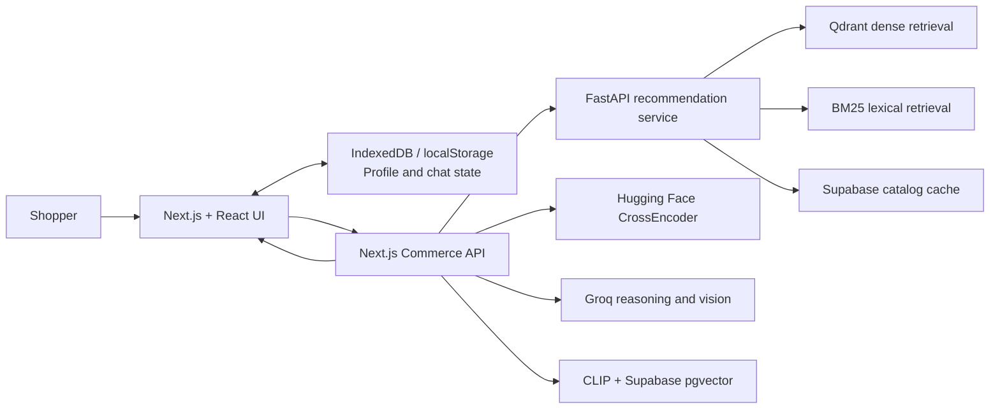
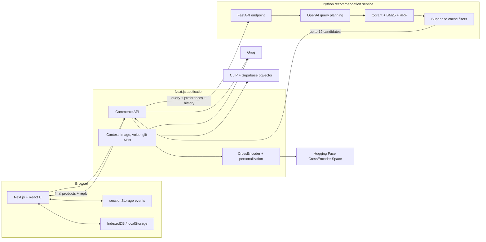
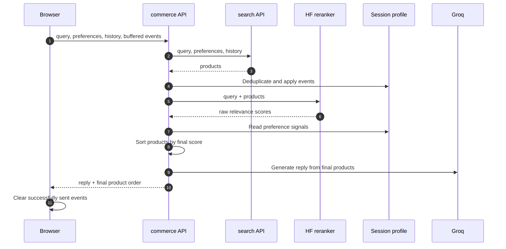
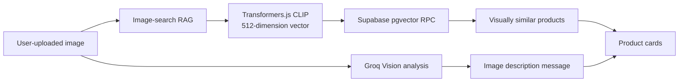

# GenieAI

GenieAI is a multilingual AI shopping assistant for product discovery, gift planning, comparison, checkout preparation, image search, and voice search. Shoppers can refine a request conversationally, save products for later, and keep track of completed orders in a browser-local profile.

Built with Next.js and TypeScript, GenieAI coordinates catalog retrieval, Groq reasoning, Hugging Face CrossEncoder reranking, session personalization, and CLIP/pgvector visual search. Its companion Python service uses FastAPI, OpenAI query planning and embeddings, Qdrant, BM25, reciprocal-rank fusion (RRF), Supabase, and canonical catalogue JSON to index and retrieve eligible products. Live recommendations come from those catalog services, while chats, Favorites, Wishlist, and order history are stored locally in the user's browser.

Related repositories: [GenieAI backend](https://github.com/GenieAI-Development/GenieAI-backend) and [GenieAI ML](https://github.com/GenieAI-Development/GenieAI-ML).

## Contents

- [Features](#features)
- [Technology stack](#technology-stack)
- [Technology flow](#technology-flow)
- [Full application architecture](#full-application-architecture)
- [Recommendation flow](#recommendation-flow)
- [Python recommendation backend](#python-recommendation-backend)
- [Search modes](#search-modes)
- [Image search RAG](#image-search-rag)
- [Shopping and Gift Box flows](#shopping-and-gift-box-flows)
- [Reranking and personalization](#reranking-and-personalization)
- [Fine-tuned reranker model](#fine-tuned-reranker-model)
- [API routes](#api-routes)
- [Repository layout](#repository-layout)
- [Setup](#setup)
- [Important environment variables](#important-environment-variables)
- [Provider responsibilities](#provider-responsibilities)
- [Alibaba Qoder credits](docs/QODER_CREDITS_USAGE.md)
- [API documentation](docs/API_DOCUMENTATION.md)
- [AI models and fallbacks](docs/AI_USAGE_AND_MODELS.md)
- [Project brief](docs/PROJECT_BRIEF.md)
- [3-minute demo video script](docs/DEMO_VIDEO_SCRIPT.md)
- [Vercel hosting](#vercel-hosting)

## Features

- Smart Shopping with an initial centered welcome experience, starter chips, and direct natural-language search.
- The preference setter is intentional and chip-driven: custom typed, voice, and image requests go straight to search without an automatic follow-up form.
- Gift Box Builder with LLM-generated contents and total-budget allocation.
- CLIP visual RAG that finds catalog products visually similar to an uploaded image.
- Qoder-assisted catalogue enrichment stores product data and Qwen 3.8 Flash-generated image intents for retrieval and image-search preparation.
- Parallel Groq Vision analysis that describes uploaded images alongside visual-search results.
- Optional Hugging Face CrossEncoder relevance ranking for Thinking searches.
- Product results are revealed in four-product batches through the Suggest more control.
- Rule-based session personalization using category, price, recency, Favorites, Wishlist, and purchase signals.
- Browser-local Profile tab with Favorites, Wishlist, and up to 25 completed orders.
- Product comparison with price-derived Value, description-derived Quality, and contextual AI fit insights.
- Delivery prediction and checkout preparation.
- AI cart product analysis that scores the complete bundle and gives improvement suggestions.
- A Qoder Cloud product-matching agent evaluates cart bundles; its agent configuration is kept in [`qoder-agents/`](qoder-agents/).
- English voice search with Groq transcription.
- Gift messages and downloadable SVG gift cards generation, including one automatic retry for transient first-generation failures.
- Per-mode persisted chats, preferences, plans, products, and paging state.

## Technology stack

| Area | Technologies | Role in GenieAI |
|---|---|---|
| Web application | Next.js 16, React 19, TypeScript | Renders the shopping experience and exposes the frontend API routes. |
| Styling | Tailwind CSS 4 | Builds the responsive chat UI, product cards, Profile dashboard, and navigation. |
| Browser persistence | IndexedDB, `localStorage`, `sessionStorage` | Persists chat state, Favorites, Wishlist, previous orders, and queued personalization events. |
| AI reasoning | Groq, Qwen 3.6/3.8, GPT-OSS | Produces commerce replies, extracts context, analyzes images, transcribes voice, and creates gift-card content. |
| Python API | FastAPI, Uvicorn, Pydantic | Serves the recommendation endpoint, validates requests, and returns product cards. |
| Query planning | OpenAI `gpt-4.1-mini` with `gpt-5-mini` fallback | Interprets recommendation requests, identifies category/price/stock constraints, and selects the category/index search plan. |
| Query embeddings | OpenAI `text-embedding-3-small` | Converts the full search message into the vector used by Qdrant dense retrieval. |
| Candidate retrieval | Qdrant, BM25, reciprocal-rank fusion | Combines dense and lexical product retrieval before filtering. |
| Catalog cache and filtering | Supabase, canonical catalog JSON | Applies stock, price, and image filters and supplies product-card data. |
| Catalogue enrichment and indexing | Qoder automations, Qwen 3.8 Flash, Qdrant, BM25 | Stores validated product data and generated image intents, then prepares dense and lexical RAG indexes. |
| Cart bundle analysis | Qoder Cloud Agent | Scores product-pair compatibility and suggests up to four bundle improvements; configuration lives in [`qoder-agents/`](qoder-agents/). |
| Relevance ranking | Hugging Face CrossEncoder | Scores candidate products against the user's query in the Next.js layer. |
| Visual search | Transformers.js CLIP, Supabase pgvector | Embeds uploaded images and retrieves visually similar catalog products. |
| Commerce operations | Commerce MCP | Supports showcase, product details, delivery, comparison, and checkout operations. |

## Technology flow



## Components

- **Next.js + React application:** the TypeScript UI, Tailwind styling, Profile tab, API routes, commerce orchestration, chat replies, context analysis, visual RAG, Groq vision analysis, voice processing, and browser-state persistence.
- **Python recommendation service:** FastAPI indexes enriched catalogue records for dense Qdrant and lexical BM25 retrieval, fuses them with RRF, and applies Supabase filters before Next.js performs final ranking. The stored product data and Qwen 3.8 Flash-generated image intents were prepared with Qoder assistance. See [Python backend details](docs/PYTHON_BACKEND.md).
- **Hugging Face CrossEncoder:** reranks catalog candidates by query relevance. See [HF reranker details](docs/HF_RERANKER.md).
- **Personalization engine:** combines browser-queued interaction events with a Next.js session profile to adjust recommendation order. See [personalization details](docs/PERSONALIZATION.md).
- **Visual-search pipeline:** Transformers.js CLIP produces the image embedding, Supabase pgvector retrieves matches, and Groq Vision supplies the companion description.
- **Delivery prediction:** provides delivery estimates and support within the shopping workflow. See [delivery prediction details](docs/DELIVERY_PREDICTION.md).

## Full application architecture



- The Python service owns first-stage retrieval and hard product filters.
- Next.js owns final product ordering, personalization, and AI replies after the Python service responds.
- The browser owns user-local chats, saved products, orders, and unsent interaction events.

## Recommendation flow



- The initial gift-category chips open the prefilled preference setter. Typed custom messages, voice input, and image search do not open a preference follow-up; they go directly to the relevant search or conversation flow.
- Product requests continue through the search API and personalization pipeline. Thinking searches also use HF reranking.
- Greetings, identity or capability questions, general conversation, and delivery-only checks use a text-only Next.js reply.
- Text-only replies skip Python and HF, return an empty product list, and hide existing product cards.

## Python recommendation backend

The Python FastAPI recommendation service is GenieAI's text-retrieval and RAG layer. It turns enriched catalogue records into two complementary indexes: Qdrant holds dense embeddings for semantic retrieval, while category-specific BM25 indexes support exact keyword matching. Qoder-assisted catalogue preparation stores validated product data together with Qwen 3.8 Flash-generated image intents, so the retrieval data includes product descriptions, availability, price, images, and useful visual-product cues.

At runtime, the service combines Qdrant dense retrieval with BM25 using reciprocal-rank fusion (RRF), then filters cached Supabase product records by stock, price, and usable-image requirements. It returns up to 12 eligible, deterministic product cards to Next.js, which can then apply personalization and optional Thinking-mode CrossEncoder reranking.

- **Indexing and enrichment:** canonical catalogue JSON and Supabase cache records supply stable product metadata. Qoder-assisted Qwen 3.8 Flash enrichment generates image intents alongside the stored product data before dense and lexical indexes are prepared.
- **Query understanding:** the OpenAI-powered planner identifies product intent, category, price limits, stock requirements, and the most suitable category/index search plan.
- **RAG retrieval:** OpenAI `text-embedding-3-small` embeds the full request for Qdrant. The original request is also searched against BM25; each source returns candidates and RRF merges their rankings.
- **Candidate controls:** retrieval widens once to 60 candidates. Supabase cache records enforce availability, price, and usable-image requirements; missing records are skipped.
- **Response boundary:** the backend orders eligible products by RRF score and returns the first 12 product cards. It does not generate the shopper-facing reply or run the CrossEncoder during normal retrieval.

See [Python Recommendation Backend](docs/PYTHON_BACKEND.md) for the runtime flow, API contract, local setup, configuration, and cache-sync process.

## Search modes

Users can choose a search mode from the compact selector beside the chat **Send** button or from **Preferences**. The selection is saved with chat state and applies to both Smart Shopping and Gift Box item searches.

| Mode | What it does | Expected time |
| --- | --- | --- |
| **Instant** | Returns the Python backend's catalog-ranked products with local personalization. It does not call the Hugging Face reranker. | Fastest option |
| **Thinking** | Sends the eligible product candidates to the Hugging Face CrossEncoder, then combines deeper relevance ranking with local personalization. | May take longer |

If Hugging Face is unavailable during a Thinking search, GenieAI preserves the catalog order so results remain available.

## Image search RAG



For the complete visual-search data flow, storage model, confidence threshold, and failure behavior, see [Image Search RAG](docs/IMAGE_SEARCH_RAG.md).

On application load, GenieAI makes a best-effort background request to warm the CLIP image-search route. The route caches model files in a writable temporary directory in serverless deployments and explicitly includes the Linux ONNX runtime artifacts in its deployment trace. This reduces first-upload latency and avoids read-only deployment-cache failures, although a serverless platform can still start a new cold instance.

## Shopping and Gift Box flows

### Smart Shopping

- Sends the current user query.
- Sends active category, budget, city, occasion, and recipient preferences.
- Sends up to three previous user messages in oldest-to-newest order.
- Excludes assistant messages and the current query from history.
- Sends `[]` when there are no earlier user messages.

### Gift Box Builder

- Generates the box-item list before product search.
- Shows every suggested box item as a chip beneath the assistant message.
- Uses the selected item's full label as the product query.
- Keeps the selected gift-box theme/category as the preference category.
- Divides the total budget range by the generated-item count.
- Sends `chatHistory: null`.
- Shows all returned products in a horizontally scrollable row.

## Reranking and personalization

### Relevance ranking

For the CrossEncoder request format, fallback behavior, and model details, see [HF Reranker](docs/HF_RERANKER.md).

- Uses the fine-tuned CrossEncoder model `ramitha2002/genieai-product-reranker`.
- Uses the HF Space `ramitha2002/product-reranker-model-api` API.
- Runs only when the user selects **Thinking** search mode; Instant mode makes no HF reranking request.
- Sends every product candidate with `top_n` equal to the candidate count.
- Uses product name/title, description, and category as model text inputs.
- Treats `rerankerScore` as a raw score that is comparable only within one query.
- Clamps raw scores to `[-20, 20]` before sigmoid normalization.
- Keeps initial product order as the relevance baseline when the HF request fails or times out.

### Hyper-personalization

For the complete event pipeline, profile lifecycle, and scoring behavior, see [Personalization](docs/PERSONALIZATION.md).

| Event | Weight |
|---|---:|
| `search` | 0.5 |
| `impression` | 0.1 |
| `view` | 1.0 |
| `compare` | 1.5 |
| `favorite` | 4.0 |
| `unfavorite` | -2.0 |
| `wishlist` | 2.5 |
| `remove_from_wishlist` | -1.0 |
| `add_to_cart` | 3.0 |
| `remove_from_cart` | -1.0 |
| `purchase` | 5.0 |

- Browser events include an `eventId` for retry-safe deduplication.
- The session profile remembers up to 500 event IDs.
- Existing category scores decay by `0.9` when a new event batch is applied.
- Positive interactions with a weight of at least `1` influence price affinity and recent-product tracking.
- A recently interacted product receives a `0.25` repeat penalty.
- Profiles expire after 24 hours of inactivity.
- The current profile store is process-local; use Redis before deploying multiple Next.js instances.
- Favorites and Wishlist are stored in the browser and queue signals for the next successful recommendation search.
- Favorites, Wishlist, and previous orders survive mode changes, reloads, and Clear Chat; Clear Chat resets conversation and mode-session data only.

### Score calculation

```text
relevance = sigmoid(rerankerScore)

preferenceScore =
  0.70 × categoryAffinity
  + 0.30 × priceAffinity
  - recentProductPenalty

finalScore = 0.75 × relevance + 0.25 × preferenceScore
```

- Scores are clamped to `[0, 1]`.
- Cold sessions omit `preferenceScore`; final order follows relevance alone.
- Final product data includes `finalScore`.
- Successful HF results also include `rerankerScore`.

## Fine-tuned reranker model

- Starts from the CrossEncoder base model `cross-encoder/ms-marco-MiniLM-L6-v2`.
- Fine-tunes on the public `tasksource/esci` dataset, a processed mirror of Amazon ESCI.
- Uses public data only; no GenieAI customer queries, catalog data, or other private examples are included in training.
- Focuses by default on ten gift-shopping categories:
  - cakes and desserts
  - flower bouquets
  - chocolates and candy
  - perfume and fragrance
  - jewelry
  - fashion and accessories
  - gift baskets and hampers
  - skincare and beauty sets
  - personalized gifts
  - home decor and candles
- Retains whole query groups, including irrelevant candidates, so ranking training reflects real product-search choices.
- Maps ESCI labels to graded relevance: Exact `1.00`, Substitute `0.70`, Complement `0.35`, and Irrelevant `0.00`.
- Uses the official ESCI train/test split.
- Uses two epochs, batch size 32, learning rate `2e-5`, and a maximum input length of 384 by default.
- Evaluates the fine-tuned model against the public base model with NDCG@10, MRR, and HitRate@4.
- Publishes the trained artifact as `ramitha2002/genieai-product-reranker` for hosted inference.

## API routes

| Route | Method | Purpose |
|---|---|---|
| `/api/ai/commerce` | POST | Main commerce orchestration and final ranking |
| `/api/ai/rerank` | POST | Standalone HF and personalization reranking pipeline |
| `/api/ai/context-analysis` | POST | Preference and language extraction |
| `/api/ai/chatbot` | POST | Standalone multilingual chatbot |
| `/api/ai/image-analysis` | POST | Image shopping hints |
| `/api/ai/image-search` | GET, POST | Best-effort CLIP warm-up and visual product retrieval from Supabase pgvector |
| `/api/ai/gift-card` | POST | Safe SVG gift-card generation |
| `/api/ai/voice-messages` | POST | English voice transcription |
| `/api/delivery-prediction` | POST | Delivery prediction support |
| `/api/personalization/session` | GET | HTTP-only anonymous session cookie |

## Repository layout

```text
GenieAI-frontend/
├── README.md
├── docs/
│   ├── HF_RERANKER.md
│   ├── IMAGE_SEARCH_RAG.md
│   ├── PERSONALIZATION.md
│   └── PYTHON_BACKEND.md
└── src/
    ├── app/
    │   └── api/
    │       ├── ai/
    │       │   ├── commerce/
    │       │   ├── rerank/route.ts
    │       │   ├── context-analysis/route.ts
    │       │   ├── image-analysis/route.ts
    │       │   ├── image-search/route.ts
    │       │   ├── gift-card/route.ts
    │       │   └── voice-messages/route.ts
    │       ├── delivery-prediction/route.ts
    │       └── personalization/session/route.ts
    ├── genie-ai/
    │   ├── GenieAIController.tsx
    │   ├── components/
    │   └── v3/
    │       ├── ProductGrid.tsx
    │       └── ProfilePanel.tsx
    ├── lib/
    │   ├── personalization/
    │   ├── reranking/
    │   ├── clipImageEmbedding.ts
    │   ├── supabaseImageSearch.ts
    │   ├── commerceMcp.ts
    │   └── groqHosted.ts
    ├── public/
    ├── env.local.example
    └── package.json
```

## Setup

Prerequisites:

- Node.js 20 or newer.
- npm.
- Running Python recommendation service.
- Shared token configured in Python and Next.js.
- Groq API key.
- Hugging Face token recommended for the hosted reranker.
- Commerce MCP access for showcase, delivery, comparison, and checkout.

Run from the repository root:

```powershell
Set-Location src
npm install
npm run build
npm start
```

For local verification, run `npm run lint`, `npx tsc --noEmit`, and `npm test` from `src`. GitHub Actions runs the same lint, type-check, and test steps for frontend changes.

- Open [http://localhost:3000](http://localhost:3000).
- Restart the server after changing `.env.local`.

## Important environment variables

| Variable | Required | Purpose |
|---|---:|---|
| `GROQ_API_KEY` | Yes | Groq credential; `GROQ_TOKEN` is also accepted |
| `AI_SERVICE_URL` | Yes for recommendations | Python recommendation service URL; requests use `/api/v1/recommendations` |
| `HF_TOKEN` | Recommended | Hosted HF reranker and HF Inference access; `HUGGINGFACE_TOKEN` also works |
| `NEXT_PUBLIC_SUPABASE_URL` | Yes for image search | Supabase project URL |
| `SUPABASE_SECRET_KEY` | Yes for image search | Server-only key used for the pgvector RPC |
| `TRANSFORMERS_CACHE_DIR` | Optional | Writable model-cache directory for server-side CLIP; defaults to `/tmp/genieai-transformers` on serverless hosts |
| `QODER_PAT` | Yes for Qoder features | Server-side Qoder Cloud personal access token |
| `QODER_ENV_ID` | Yes for Qoder features | Qoder Cloud environment ID |
| `QODER_PRODUCT_MATCHING_AGENT_ID` | Yes for cart matching | ID of the `genie-product-matching` agent; falls back to `QODER_AGENT_ID` |

- Keep every credential and secret server-only. `NEXT_PUBLIC_SUPABASE_URL` is
  the intentionally public project URL, not a credential.
- Never use the `NEXT_PUBLIC_` prefix for credentials or service tokens.
- See [`src/env.local.example`](src/env.local.example) for the full optional configuration list.

## Provider responsibilities

| Capability | Provider / model | Fallback or note |
|---|---|---|
| Candidate retrieval and hard filters | Python backend | Returns 12 eligible products |
| Browser profile and saved products | IndexedDB / localStorage | Keeps chats, Favorites, Wishlist, and previous orders on the user's browser |
| Relevance reranking | Fine-tuned CrossEncoder `ramitha2002/genieai-product-reranker` via HF Space `ramitha2002/product-reranker-model-api` | Python order becomes relevance baseline |
| Session personalization | Next.js rule engine | Cold sessions use relevance only |
| Context, commerce replies, guided plans | Groq `openai/gpt-oss-120b` | Local/route fallback behavior |
| Product comparison and English gift messages | Groq `openai/gpt-oss-20b` | Deterministic or generic fallback |
| Sinhala and Singlish responses | Groq `openai/gpt-oss-120b` | HF Novita can assist selected language flows |
| Novita language generation | HF Inference `google/gemma-4-31B-it:novita` | Groq fallback where configured |
| Image analysis | Groq `qwen/qwen3.6-27b` | Concise visual description shown beside visual-RAG results |
| Image search | Transformers.js CLIP + Supabase pgvector | Visual-only; max four products; no reranking or personalization |
| Gift-card art direction | Groq `qwen/qwen3.6-27b` | Backup `qwen/qwen3.8-27b` |
| Voice transcription | Groq `whisper-large-v3-turbo` | Retry response |
| Default showcase, details, delivery, checkout | Commerce MCP | Feature-specific error behavior |
| Read aloud | Browser Speech Synthesis API | No server model |

## Vercel hosting

The frontend is designed for Vercel hosting, where the Next.js UI and API routes run together. Groq, Hugging Face, Supabase, the Python recommendation service, and the Commerce MCP are external services configured through environment variables.
