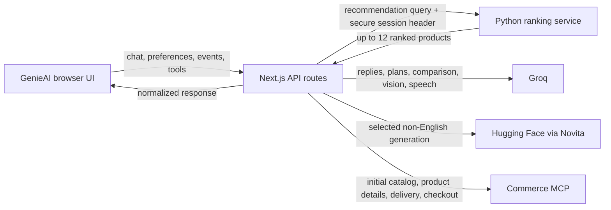

# GenieAI

GenieAI is a responsive, multilingual gift-shopping assistant built with Next.js. It combines conversational shopping, Python-based product ranking, guided event and gift-box planning, product comparison, gift-message generation, image and voice input, delivery checks, and checkout preparation in one interface.

The runnable Next.js application is in [`src`](src). Browser code calls only local Next.js API routes. Those server routes securely coordinate the Python ranking service, Groq, Hugging Face through Novita, and the commerce MCP service.

## Contents

- [Features](#features)
- [Architecture](#architecture)
- [Product recommendation flow](#product-recommendation-flow)
- [Guided mode flow](#guided-mode-flow)
- [Product paging and Suggest more](#product-paging-and-suggest-more)
- [Personalization events](#personalization-events)
- [Technology](#technology)
- [Repository layout](#repository-layout)
- [Prerequisites](#prerequisites)
- [Local setup](#local-setup)
- [Environment variables](#environment-variables)
- [Python ranking contract](#python-ranking-contract)
- [Next.js API routes](#nextjs-api-routes)
- [Application modes](#application-modes)
- [State and persistence](#state-and-persistence)
- [AI and provider routing](#ai-and-provider-routing)
- [Commerce MCP responsibilities](#commerce-mcp-responsibilities)
- [Development commands](#development-commands)
- [Verification](#verification)
- [Deployment](#deployment)
- [Troubleshooting](#troubleshooting)
- [Security notes](#security-notes)
- [Further documentation](#further-documentation)

## Features

- Smart Shopping with conversational preference collection
- Event Planner with plan-first, item-by-item recommendations
- Gift Box Builder with total-budget allocation across box items
- Up to 12 ranked products per recommendation request
- Four product cards displayed at a time
- Local product paging without rerunning Python ranking
- AI-generated replies for each Suggest more action
- Product comparison initiated directly from product cards
- AI comparison insights with up to four percentage dimensions
- Gift-message generation and checkout-field storage
- Product-aware Gift Card image generation with downloadable SVG output
- Image-based shopping hints
- English voice search and transcription
- Browser-based read-aloud for English assistant messages
- Buy Box/cart and guest-checkout preparation
- Delivery city/date handling
- Buffered personalization events
- Per-mode chat, plan, product, and preference persistence
- Responsive desktop and mobile layouts
- English, Sinhala, and Singlish response handling

## Architecture



The Python service ranks recommendation results. It is not called for initial showcase products, local Suggest more paging, plan generation, product comparison lookup, delivery checks, gift-message generation, or checkout creation.

## Product recommendation flow

1. The browser collects the query, active preferences, and pending personalization events.
2. It sends one request to `POST /api/ai/commerce` with `task: "recommend"`.
3. Next.js reads or creates the secure personalization session cookie.
4. Next.js sends the query, normalized preferences, and events to `AI_SERVICE_URL/v1/commerce/recommendations`.
5. The Python service returns up to 12 final products in ranked order.
6. Next.js normalizes Python product fields into the UI product schema.
7. Next.js generates the conversational reply using only the returned products.
8. The browser stores all 12 products and displays the first four.
9. Only the events included in a successful recommendation request are removed from the browser queue.

The Python session ID, backend bearer token, internal personalization profile, and internal ranking details are never sent to browser code.

### Default product showcase

The first-load showcase uses `task: "initial"`. It loads catalog products through the commerce MCP and does not require the Python backend. It still requires the commerce MCP endpoint to be reachable.

## Guided mode flow

Event Planner and Gift Box Builder separate plan generation from product ranking:

1. The UI collects the guided-mode context.
2. Next.js/Groq generates the item plan first.
3. No broad catalog or Python product search runs during plan generation.
4. The total budget is divided across plan items.
5. The UI requests recommendations for only the current plan item.
6. Next.js sends that item query, item category, per-item budget, recipient, occasion, and pending events to Python.
7. Next and Previous item actions request products only for the newly selected item.

The active mode, full plan, current plan index, preferences, products, and product-page index remain inside the Next.js application state. Python does not receive the UI mode or complete plan.

### Budget allocation

- Event Planner divides the total budget by the generated plan-item count.
- Gift Box Builder divides the total budget by the selected gift-box item count.
- A total budget of `Rs. 10,000` for four items produces a per-item search budget of `Rs. 2,500`.

## Product paging and Suggest more

Each ranked response can contain up to 12 products:

| Display state | Visible products | Behavior |
|---|---:|---|
| Initial | Ranks 1–4 | First ranked batch |
| First Suggest more | Ranks 5–8 | Cards switch locally; Next.js generates reply text |
| Second Suggest more | Ranks 9–12 | Cards switch locally; Next.js generates reply text |
| Next action/fourth state | None | Generates the “all matched products shown” reply and invites a query/preference change |

Suggest more never calls Python, searches the catalog, or reranks. It calls the AI-only `productPageReply` task for conversational text. If AI reply generation fails, the UI uses a localized fallback sentence.

## Personalization events

The browser buffers interactions in `sessionStorage` instead of posting every interaction immediately.

Supported events include:

- `search`
- `impression`
- `view`
- `compare`
- `add_to_cart`
- `remove_from_cart`
- `purchase`

Queue behavior:

- maximum 100 pending events
- duplicate impressions for the same product/query are removed
- events are attached only to recommendation requests
- sent events are cleared only after a successful Python response
- events remain queued when a request fails
- an in-memory queue is used if `sessionStorage` is unavailable

There is no `/api/personalization/events` endpoint. `GET /api/personalization/session` remains responsible for establishing the secure session cookie.

## Technology

- Next.js 16.2
- React 19.2
- TypeScript 5
- Tailwind CSS 4
- ESLint 9
- Groq hosted models
- Hugging Face Inference Providers through Novita
- Python recommendation/reranking service
- Commerce MCP over streamable HTTP
- IndexedDB, `localStorage`, and `sessionStorage` for browser persistence
- Netlify Next.js deployment support

## Repository layout

```text
GenieAI-frontend/
├── API_DOCUMENTATION.md
├── README.md
├── ai-usage-and-models.txt
├── backend-todo/
├── frontend-todo/
├── guidelines/
├── netlify.toml
├── reranker-pipeline/
└── src/
    ├── app/
    │   ├── api/
    │   │   ├── ai/
    │   │   │   ├── chatbot/route.ts
    │   │   │   ├── commerce/route.ts
    │   │   │   ├── context-analysis/route.ts
    │   │   │   ├── image-analysis/route.ts
    │   │   │   ├── gift-card/route.ts
    │   │   │   └── voice-messages/route.ts
    │   │   └── personalization/session/route.ts
    │   ├── ai-chatbot/page.tsx
    │   ├── demo-video/page.tsx
    │   ├── features/page.tsx
    │   ├── image-analysis/page.tsx
    │   ├── voice-messages/page.tsx
    │   ├── globals.css
    │   ├── layout.tsx
    │   └── page.tsx
    ├── genie-ai/
    │   ├── v3/
    │   ├── GenieAIApp.tsx
    │   └── GenieAIController.tsx
    ├── lib/
    │   ├── personalization/
    │   ├── aiPayload.ts
    │   ├── commerceMcp.ts
    │   ├── deliveryLocations.ts
    │   ├── groqHosted.ts
    │   ├── huggingFaceNovita.ts
    │   └── productCatalog.ts
    ├── public/
    ├── .env.local
    ├── env.local.example
    ├── package.json
    └── tsconfig.json
```

## Prerequisites

- Node.js 20 or newer
- npm
- a Groq API key
- a running Python ranking service for recommendation searches
- a shared token configured in both Next.js and the Python service
- access to the commerce MCP service
- optionally, a Hugging Face token for Novita-backed language flows

## Local setup

Run the application commands from `src`:

```powershell
Set-Location src
npm install
Copy-Item env.local.example .env.local
```

Edit `.env.local`, then start development:

```powershell
npm run dev
```

Open [http://localhost:3000](http://localhost:3000).

Restart the development server after changing environment variables.

## Environment variables

Use [`src/env.local.example`](src/env.local.example) as the template. Secrets must remain server-only unless a variable is explicitly named with `NEXT_PUBLIC_`.

### Core services

| Variable | Required | Purpose |
|---|---|---|
| `GROQ_API_KEY` | Yes | Groq chat, planning, comparison, vision, and transcription. `GROQ_TOKEN` is also accepted by the code. |
| `AI_SERVICE_URL` | For recommendations | Python service base URL, such as `http://localhost:8000`. |
| `AI_SERVICE_TOKEN` | For recommendations | Bearer token shared with the Python service. Keep server-only. |
| `HF_TOKEN` | Optional | Hugging Face Inference Providers access. `HUGGINGFACE_TOKEN` is also accepted. |
| `COMMERCE_MCP_URL` | Optional | Overrides the default commerce MCP endpoint. |

### Model selection and timeouts

| Variable | Purpose |
|---|---|
| `GROQ_REPLY_MODEL` | Standalone chatbot model. |
| `GROQ_PROCESSING_MODEL` | Message/context processing model. |
| `GROQ_CONTEXT_MODEL` | Context-analysis override. |
| `GROQ_COMMERCE_MODEL` | Commerce reasoning override. |
| `GROQ_ENGLISH_CHAT_MODEL` | English commerce and local product-page reply model. |
| `GROQ_SINHALA_CHAT_MODEL` | Sinhala commerce and local product-page reply model. |
| `GROQ_SINGLISH_CHAT_MODEL` | Singlish commerce and local product-page reply model. |
| `GROQ_COMPARE_MODEL` | Product comparison-insights model. |
| `GROQ_GIFT_MESSAGE_MODEL` | English gift-message model. |
| `GROQ_SINHALA_GIFT_MESSAGE_MODEL` | Sinhala gift-message Groq fallback. |
| `GROQ_SINGLISH_GIFT_MESSAGE_MODEL` | Singlish gift-message Groq fallback. |
| `GROQ_VISION_MODEL` | Image-analysis model. |
| `GROQ_VISION_BACKUP_MODEL` | Image-analysis fallback model. |
| `GROQ_GIFT_CARD_MODEL` | Multimodal Gift Card art-direction model. Defaults to `qwen/qwen3.6-27b`. |
| `GROQ_GIFT_CARD_BACKUP_MODEL` | Gift Card multimodal fallback. Defaults to `qwen/qwen3.8-27b`. |
| `GROQ_BACKUP_MODEL` | First general Groq fallback model. |
| `GROQ_BACKUP_MODELS` | Optional comma-separated additional Groq fallback models. |
| `GROQ_REQUEST_TIMEOUT_MS` | Timeout for one Groq model attempt. |
| `GROQ_TOTAL_TIMEOUT_MS` | Total Groq fallback-chain timeout. |
| `HF_NOVITA_REPLY_MODEL` | Hugging Face model/provider route used through Novita. |
| `HF_NOVITA_REPLY_TIMEOUT_MS` | Novita reply timeout. |
| `MCP_REQUEST_TIMEOUT_MS` | Commerce MCP request timeout. |

### Commerce tool overrides

| Variable | Purpose |
|---|---|
| `COMMERCE_SEARCH_PRODUCTS_TOOL` | Product-search tool name. |
| `COMMERCE_GET_PRODUCT_TOOL` | Product-detail tool name. |
| `COMMERCE_LIST_DELIVERY_CITIES_TOOL` | Delivery-city tool name. |
| `COMMERCE_CHECK_DELIVERY_TOOL` | Delivery-check tool name. |
| `COMMERCE_CREATE_ORDER_TOOL` | Checkout/order-creation tool name. |

### Public UI configuration

| Variable | Purpose |
|---|---|
| `NEXT_PUBLIC_DEMO_VIDEO_EMBED_URL` | Video URL used by the demo page. This value is public. |

### Minimal local example

```dotenv
GROQ_API_KEY=your_groq_key
AI_SERVICE_URL=http://localhost:8000
AI_SERVICE_TOKEN=the_same_token_used_by_python
HF_TOKEN=optional_hugging_face_token

GROQ_ENGLISH_CHAT_MODEL=openai/gpt-oss-120b
GROQ_PROCESSING_MODEL=llama-3.3-70b-versatile
GROQ_CONTEXT_MODEL=llama-3.3-70b-versatile
GROQ_COMMERCE_MODEL=llama-3.3-70b-versatile
GROQ_BACKUP_MODEL=qwen/qwen3.6-27b
GROQ_REQUEST_TIMEOUT_MS=5000
GROQ_TOTAL_TIMEOUT_MS=10000
MCP_REQUEST_TIMEOUT_MS=4000
```

## Python ranking contract

Next.js calls:

```text
POST {AI_SERVICE_URL}/v1/commerce/recommendations
```

Server-added headers:

```http
Authorization: Bearer <AI_SERVICE_TOKEN>
X-Genie-Session-Id: <secure-session-id>
Content-Type: application/json
```

Example request:

```json
{
  "query": "birthday flowers for mother",
  "preferences": {
    "budgetMin": 2500,
    "budgetMax": 6000,
    "category": "Flowers",
    "deliveryCity": "Colombo",
    "occasion": "Birthday",
    "recipient": "Mother"
  },
  "events": [
    {
      "event": "view",
      "productId": "product-45",
      "category": "Flowers",
      "price": 4500,
      "query": "birthday flowers",
      "timestamp": "2026-08-30T10:00:00.000Z"
    }
  ]
}
```

Example Python response:

```json
{
  "products": [
    {
      "id": "product-45",
      "title": "Pink Rose Bouquet",
      "description": "Fresh roses for birthdays",
      "price": 4500,
      "currency": "LKR",
      "category": "Flowers",
      "image": "https://example.com/rose.jpg",
      "inStock": true,
      "url": "https://example.com/products/product-45",
      "finalScore": 0.91
    }
  ]
}
```

The response may contain up to 12 products. The adapter accepts common field variants including `title`/`name`, `image`/`imageUrl`/`image_url`, `inStock`/`in_stock`, and numeric or `{ amount, currency }` prices. Invalid products without an ID and name are discarded.

## Next.js API routes

### `POST /api/ai/commerce`

The main task-based orchestration route.

| Task | Responsibility | Python called? |
|---|---|---:|
| `initial` | Load default showcase products through commerce MCP | No |
| `recommend` | Send query, preferences, and events to Python; generate reply from returned products | Yes |
| `productPageReply` | Generate text for locally paged products or the exhausted state | No |
| `eventPlan` | Generate an Event Planner item plan before product search | No |
| `giftBox` | Generate a Gift Box item plan before product search | No |
| `compare` | Resolve selected catalog products and generate comparison insights | No |
| `checkout` | Validate checkout details and create a guest-checkout link | No |
| `giftMessage` | Generate gift-card text | No |

Order tracking is not supported. Unsupported tasks return `400`.

### `POST /api/ai/context-analysis`

Combines local heuristics and Groq analysis to extract budget, category/gift type, occasion, recipient, detected language, and missing fields from the first shopping message.

### `POST /api/ai/chatbot`

Standalone multilingual chatbot route used by the chatbot/demo page.

### `POST /api/ai/image-analysis`

Accepts a multipart `image` upload up to 4 MB and returns a summary, labels, visible text, product hints, and a search query. Groq vision is used when available; filename-based hints provide a degraded fallback.

### `POST /api/ai/gift-card`

Accepts one selected cart product and the user's language, recipient, occasion, style, theme, and card instructions. Groq analyzes the product image and returns a validated color palette, motif, headline, message, and visual rationale. Next.js renders those values into a safe 1200×800 SVG image; model-provided SVG or HTML is never rendered directly.

### `POST /api/ai/voice-messages`

Accepts multipart audio up to 12 MB. Voice search is English-only and uses `whisper-large-v3-turbo`. Read-aloud is not handled here; the browser Speech Synthesis API performs read-aloud.

### `GET /api/personalization/session`

Creates or reuses an HTTP-only `genie_personalization_session` cookie. The cookie is `SameSite=Lax`, path-wide, and `Secure` in production.

See [`API_DOCUMENTATION.md`](API_DOCUMENTATION.md) for request/response details and the full API calling flow.

## Application modes

### Smart Shopping

- collects category, budget, occasion, and recipient preferences
- sends recommendation requests to Python
- displays four of up to 12 ranked products
- supports local Suggest more paging
- adds products to the Buy Box

### Event Planner

- collects event type, participant/venue context, and total budget
- generates the plan before searching for products
- allocates a per-item budget
- requests Python products only for the current plan item
- supports Next item, Previous item, and local Suggest more

### Gift Box Builder

- collects recipient, theme, item count, and total budget
- generates the box plan before product search
- divides the total budget across selected items
- requests Python products only for the current item

### Product Compare

1. Click Compare on a product card.
2. Select one additional product.
3. Click Done in the chat header.
4. The app moves to Product Compare.

The comparison page shows only product name, price, full description, and up to four AI insight percentages such as Value, Quality, Occasion Match, and Recipient Match. Product ID input fields are not displayed.

### Gift Message

- opening the tab does not automatically generate a message
- generation occurs only after an explicit user action
- English uses Groq only
- generated text is stored in the checkout gift-message field
- the app does not redirect to checkout after generation

### Gift Card

- opens from the Card tab inside the Gift Message window; it is not a separate navigation mode
- requires the user to select a product already in the cart
- prefills language, occasion, and recipient from the active shopping preferences when available
- lets the user choose language, style, theme, occasion, recipient, and instructions before generation
- optionally displays receiver and sender names on the generated card
- uses the selected product image, name, and description for visual matching
- displays the generated image in the generator panel and provides an SVG download
- stores the generated card and preferences with browser chat state
- copies the generated card message into the checkout gift-message field without opening checkout

### Product details

The product popup displays the product image, price, and full description.

## State and persistence

- Chat state uses IndexedDB when available and falls back to `localStorage`.
- Each mode keeps its own messages, preferences, plan items, plan index, products, fit reasons, and product-page index.
- The Buy Box is persisted with the chat state.
- Personalization events use `sessionStorage` plus an in-memory fallback.
- The welcome panel records its daily display state in `localStorage`.
- Clearing chat history clears stored chat state while preserving the currently loaded product showcase.

## AI and provider routing

| Capability | Primary provider | Fallback/degraded behavior |
|---|---|---|
| Context analysis | Groq | Local preference heuristics |
| Python-ranked shopping reply | Groq reasoning/reply | Route-level fallback response |
| Local product-page reply | Groq | Localized fixed sentence |
| Event/Gift Box plan | Groq | Normalized local plan handling |
| English gift message | Groq only | Generic local gift message when no provider starts |
| Sinhala/Singlish gift message | Novita first, then configured Groq | Generic local message where applicable |
| Product comparison insights | Groq | Deterministic percentage insights |
| Image analysis | Groq vision | Filename-derived hints |
| Gift Card image | Groq multimodal art direction + server-rendered SVG | Request error; no unvalidated model markup is rendered |
| Voice transcription | Groq Whisper | Retry response for unclear speech |
| Read aloud | Browser speech synthesis | No server model |

Groq requests use configured fallbacks and bounded per-model/total timeouts. Model output is cleaned before display to remove model-thinking blocks.

## Commerce MCP responsibilities

The MCP integration in [`src/lib/commerceMcp.ts`](src/lib/commerceMcp.ts) handles:

- default product showcase search
- product-detail lookup for comparison
- delivery-city listing and normalization
- delivery availability/rates
- guest-checkout creation

The client supports JSON and SSE MCP responses, reuses sessions for up to ten minutes, retries invalid/expired sessions, and bounds requests with a configurable timeout.

## Development commands

Run from `src`:

```powershell
npm run dev
npm run build
npm run start
npm run lint
```

Focused TypeScript validation:

```powershell
node node_modules/typescript/bin/tsc --noEmit
```

Generate Next.js route types after adding or deleting routes:

```powershell
node node_modules/next/dist/bin/next typegen
```

## Verification

Before merging a change:

```powershell
Set-Location src
node node_modules/next/dist/bin/next typegen
node node_modules/typescript/bin/tsc --noEmit
npm run lint
npm run build
```

Recommended manual checks:

- default showcase renders four cards without Python configuration
- a recommendation returns and preserves up to 12 ranked products
- Suggest more shows 5–8, then 9–12, without a Python call
- the fourth display state hides cards and generates the exhausted reply
- Event/Gift Box plan generation occurs before item ranking
- per-item budgets match total budget divided by item count
- mode switching restores the correct plan and product page
- event queue survives failures and clears after success
- comparison selection accepts exactly two cards
- gift-message generation stores text without opening checkout
- mobile header, navigation, timeline, preference setter, and composer remain within the viewport

## Deployment

[`netlify.toml`](netlify.toml) configures Netlify to:

- use `src` as the build base
- run `npm run build`
- publish `.next`
- use `@netlify/plugin-nextjs`

Configure all server environment variables in the deployment platform. Never expose `AI_SERVICE_TOKEN`, Groq credentials, Hugging Face credentials, or commerce credentials through `NEXT_PUBLIC_` variables.

The deployed Next.js server must be able to reach both the Python ranking URL and commerce MCP endpoint. Browser microphone features require HTTPS outside localhost.

## Troubleshooting

### Default showcase works, but searches fail

The default showcase uses commerce MCP while recommendation searches use Python. Check `AI_SERVICE_URL`, `AI_SERVICE_TOKEN`, the Python `/v1/commerce/recommendations` route, and matching backend token configuration.

### Default showcase is empty

Check commerce MCP connectivity, `COMMERCE_MCP_URL`, search-tool configuration, and `MCP_REQUEST_TIMEOUT_MS`.

### Python returns products, but cards are empty

Each product needs a non-empty `id` and either `title` or `name`. Confirm the response has a top-level `products` array and uses supported image, stock, and price fields.

### Suggest more unexpectedly calls Python

The client should call `task: "productPageReply"`, not `task: "recommend"`. Product cards must be sliced from the stored 12-product response.

### Event or Gift Box searches use the wrong category

Confirm the guided item request sends the current item search term as both the item query and category. The overall theme must not replace the current item.

### AI routes return credential errors

Set `GROQ_API_KEY` or `GROQ_TOKEN`, then restart the Next.js server. Set `HF_TOKEN` only for flows that use Novita.

### Voice input fails

Use English speech, grant microphone permission, keep audio under 12 MB, and verify access to Groq Whisper.

### Image analysis fails

Keep images under 4 MB and verify the configured Groq vision model is available.

### Stale route type errors after deleting an API route

Run:

```powershell
node node_modules/next/dist/bin/next typegen
```

Then rerun TypeScript validation.

## Security notes

- Keep all provider and backend tokens server-only.
- Validate and rate-limit public API routes before production launch.
- Treat model output and external product data as untrusted input.
- Do not expose the secure personalization session ID to browser JavaScript.
- Validate checkout details again in the downstream commerce service.
- Add idempotency protection before enabling production order creation at scale.
- Prices, stock, delivery availability, and checkout links can change; use current provider responses.

## Further documentation

- [`API_DOCUMENTATION.md`](API_DOCUMENTATION.md) — detailed API requests, responses, environment variables, and flow diagram
- [`ai-usage-and-models.txt`](ai-usage-and-models.txt) — model usage notes
- [`frontend-todo/FRONTEND_TODO.md`](frontend-todo/FRONTEND_TODO.md) — frontend/Python integration checklist
- [`backend-todo/FRONTEND_BACKEND_INTEGRATION.md`](backend-todo/FRONTEND_BACKEND_INTEGRATION.md) — Python backend contract and implementation notes
- [`guidelines`](guidelines) — design prototypes and reference material

## License

No license file is currently included. Add one before distributing the project publicly.
