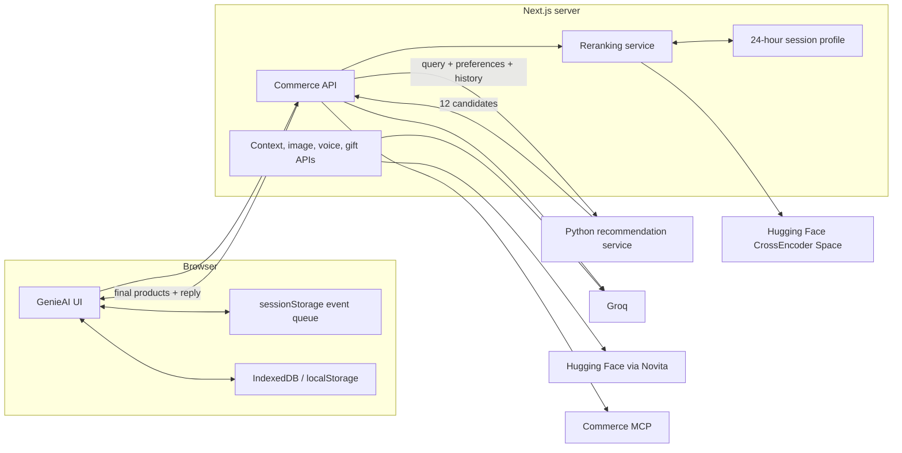
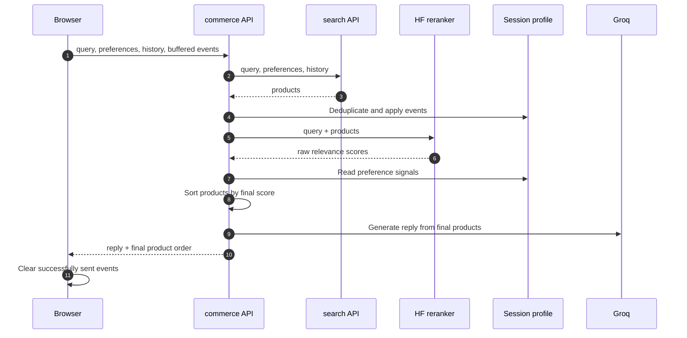
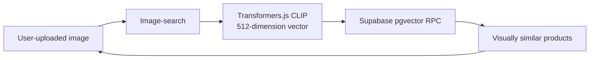
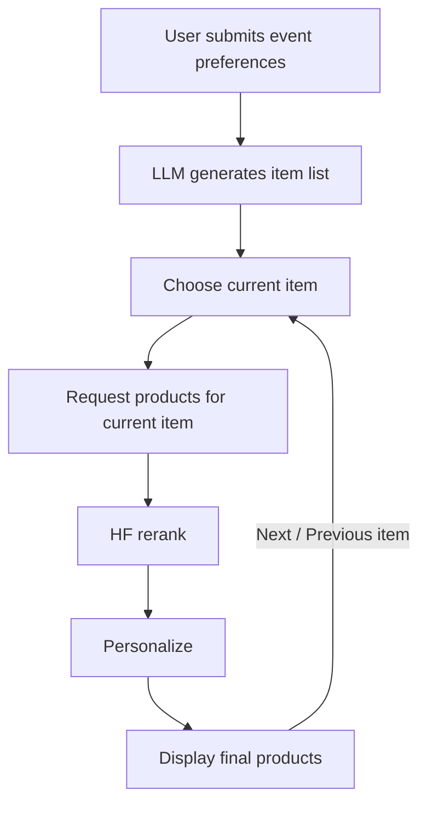

# GenieAI

// add brief 2 paragraphs here, describing funtionalities and tech stack.

## Contents

- [Features](#features)
- [Architecture](#architecture)
- [Recommendation flow](#recommendation-flow)
- [Image search RAG](#image-search-rag)
- [Mode flows](#mode-flows)
- [Reranking and personalization](#reranking-and-personalization)
- [Fine-tuned reranker model](#fine-tuned-reranker-model)
- [API routes](#api-routes)
- [Repository layout](#repository-layout)
- [Setup](#setup)
- [Important environment variables](#important-environment-variables)
- [Provider responsibilities](#provider-responsibilities)
- [Vercel hosting](#vercel-hosting)

## Features

- Smart Shopping with preference collection and recent user-message context.
- Gift Box Builder with LLM-generated contents and total-budget allocation.
- Event Planner with LLM-generated item lists and per-item product requests.
- Image search with using RAG. //improve this
- Hugging Face CrossEncoder relevance ranking for all returned candidates.
- Rule-based session personalization using category, price, and recency signals.
- Product comparison, delivery pedictions, and checkout preparation.
- AI cart product analysis that scores the complete bundle and gives improvement suggestions.
- Voice search. //improve this
- Gift messages and downloadable SVG gift cards generation.
- Per-mode persisted chats, preferences, plans, products, and paging state.

## Compoenents

// add each parts there shortly (as points)
1. next js backend (include all features, chat replys, context analysis, image search rag and eberything)
2. python backend part (todo)
3. hf cross encoder (with link to readme)
4. personalization part (with link to readme)
5. delivery prediction part (with link to readme)

## Architecture



- Python backend retrieves and filters the candidate products.
- Next.js backend owns the final product order.
- Next.js backend applies the HF CrossEncoder, personalization rules, and reply generation after Python responds.

## Recommendation flow



- Context analysis decides whether the latest message requires product search.
- Product requests continue through the search API, HF reranking, and personalization pipeline.
- Greetings, identity or capability questions, general conversation, and delivery-only checks use a text-only Next.js reply.
- Text-only replies skip Python and HF, return an empty product list, and hide existing product cards.

## Image search RAG



// create separate doc calls data flows and move this there and link it to readme.
## Mode flows

### Smart Shopping

- Sends the current user query.
- Sends active category, budget, city, occasion, and recipient preferences.
- Sends up to three previous user messages in oldest-to-newest order.
- Excludes assistant messages and the current query from history.
- Sends `[]` when there are no earlier user messages.

### Event Planner



- Generates the item list before product search.
- Uses the current generated item as `query`.
- Uses `Events` as the preference category.
- Divides both ends of a budget range by the generated-item count.
- Sends `chatHistory: null`.
- Keeps participants and venue in Next.js unless they materially improve the item query.

### Gift Box Builder

- Generates the box-item list before product search.
- Uses the current generated item as `query`.
- Keeps the selected gift-box theme/category as the preference category.
- Divides the total budget range by the generated-item count.
- Sends `chatHistory: null`.
- Uses the same Next/Previous item behavior as Event Planner.

## Reranking and personalization

// add python backend ranking - todo

// combine Relevance ranking and finetuned reranker model
### Relevance ranking

- Uses the fine-tuned CrossEncoder model `ramitha2002/genieai-product-reranker`.
- Uses the HF Space `ramitha2002/product-reranker-model-api` API.
- Sends every product candidate with `top_n` equal to the candidate count.
- Uses product name/title, description, and category as model text inputs.
- Treats `rerankerScore` as a raw score that is comparable only within one query.
- Clamps raw scores to `[-20, 20]` before sigmoid normalization.
- Keeps initial product order as the relevance baseline when the HF request fails or times out.

### Hyper-personalization

| Event | Weight |
|---|---:|
| `search` | 0.5 |
| `impression` | 0.1 |
| `view` | 1.0 |
| `compare` | 1.5 |
| `add_to_cart` | 3.0 |
| `remove_from_cart` | -1.0 |
| `purchase` | 5.0 |

- Browser events include an `eventId` for retry-safe deduplication.
- The session profile remembers up to 500 event IDs.
- Existing category scores decay by `0.9` when a new event batch is applied.
- Positive interactions with a weight of at least `1` influence price affinity and recent-product tracking.
- A recently interacted product receives a `0.25` repeat penalty.
- Profiles expire after 24 hours of inactivity.
- The current profile store is process-local; use Redis before deploying multiple Next.js instances.

### Score calculation

```text
relevance = sigmoid(rerankerScore)

preferenceScore =
  0.70 × categoryAffinity
  + 0.30 × priceAffinity
  - recentProductPenalty

finalScore = 0.75 × relevance + 0.25 × preferenceScore
```

- Scores are clamped to `[0, 1]`.
- Cold sessions omit `preferenceScore`; final order follows relevance alone.
- Final product data includes `finalScore`.
- Successful HF results also include `rerankerScore`.

## Fine-tuned reranker model

- Starts from the CrossEncoder base model `cross-encoder/ms-marco-MiniLM-L6-v2`.
- Fine-tunes on the public `tasksource/esci` dataset, a processed mirror of Amazon ESCI.
- Uses public data only; no GenieAI customer queries, catalog data, or other private examples are included in training.
- Focuses by default on ten gift-shopping categories:
  - cakes and desserts
  - flower bouquets
  - chocolates and candy
  - perfume and fragrance
  - jewelry
  - fashion and accessories
  - gift baskets and hampers
  - skincare and beauty sets
  - personalized gifts
  - home decor and candles
- Retains whole query groups, including irrelevant candidates, so ranking training reflects real product-search choices.
- Maps ESCI labels to graded relevance: Exact `1.00`, Substitute `0.70`, Complement `0.35`, and Irrelevant `0.00`.
- Uses the official ESCI train/test split.
- Uses two epochs, batch size 32, learning rate `2e-5`, and a maximum input length of 384 by default.
- Evaluates the fine-tuned model against the public base model with NDCG@10, MRR, and HitRate@4.
- Publishes the trained artifact as `ramitha2002/genieai-product-reranker` for hosted inference.

## API routes

| Route | Method | Purpose |
|---|---|---|
| `/api/ai/commerce` | POST | Main commerce orchestration and final ranking |
| `/api/ai/rerank` | POST | Standalone HF and personalization reranking pipeline |
| `/api/ai/context-analysis` | POST | Preference and language extraction |
| `/api/ai/chatbot` | POST | Standalone multilingual chatbot |
| `/api/ai/image-analysis` | POST | Image shopping hints |
| `/api/ai/image-search` | POST | CLIP visual product retrieval from Supabase pgvector |
| `/api/ai/gift-card` | POST | Safe SVG gift-card generation |
| `/api/ai/voice-messages` | POST | English voice transcription |
| `/api/delivery-prediction` | POST | Delivery prediction support |
| `/api/personalization/session` | GET | HTTP-only anonymous session cookie |

## Repository layout

```text
GenieAI-frontend/
├── README.md
└── src/
    ├── app/api/ai/
    │   ├── commerce/
    │   ├── rerank/route.ts
    │   ├── context-analysis/route.ts
    │   ├── image-analysis/route.ts
    │   ├── image-search/route.ts
    │   ├── gift-card/route.ts
    │   └── voice-messages/route.ts
    ├── genie-ai/GenieAIController.tsx
    ├── lib/personalization/
    ├── lib/reranking/
    ├── lib/commerceMcp.ts
    ├── lib/groqHosted.ts
    ├── lib/clipImageEmbedding.ts
    ├── lib/supabaseImageSearch.ts
    ├── env.local.example
    └── package.json
```

## Setup

Prerequisites:

- Node.js 20 or newer.
- npm.
- Running Python recommendation service.
- Shared token configured in Python and Next.js.
- Groq API key.
- Hugging Face token recommended for the hosted reranker.
- Commerce MCP access for showcase, delivery, comparison, and checkout.

Run from the repository root:

```powershell
Set-Location src
npm install
npm run build
npm start
```

- Open [http://localhost:3000](http://localhost:3000).
- Restart the server after changing `.env.local`.

## Important environment variables

| Variable | Required | Purpose |
|---|---:|---|
| `GROQ_API_KEY` | Yes | Groq credential; `GROQ_TOKEN` is also accepted |
| `AI_SERVICE_URL` | Yes for recommendations | Python recommendation service URL; requests use `/api/v1/recommendations` |
| `HF_TOKEN` | Recommended | Hosted HF reranker and HF Inference access; `HUGGINGFACE_TOKEN` also works |
| `NEXT_PUBLIC_SUPABASE_URL` | Yes for image search | Supabase project URL |
| `SUPABASE_SECRET_KEY` | Yes for image search | Server-only key used for the pgvector RPC |
| `QODER_PAT` | Yes for Qoder features | Server-side Qoder Cloud personal access token |
| `QODER_ENV_ID` | Yes for Qoder features | Qoder Cloud environment ID |
| `QODER_PRODUCT_MATCHING_AGENT_ID` | Yes for cart matching | ID of the `genie-product-matching` agent; falls back to `QODER_AGENT_ID` |

- Keep every credential and secret server-only. `NEXT_PUBLIC_SUPABASE_URL` is
  the intentionally public project URL, not a credential.
- Never use the `NEXT_PUBLIC_` prefix for credentials or service tokens.
- See [`src/env.local.example`](src/env.local.example) for the full optional configuration list.

## Provider responsibilities

| Capability | Provider / model | Fallback or note |
|---|---|---|
| Candidate retrieval and hard filters | Python backend | Returns 12 eligible products |
| Relevance reranking | Fine-tuned CrossEncoder `ramitha2002/genieai-product-reranker` via HF Space `ramitha2002/product-reranker-model-api` | Python order becomes relevance baseline |
| Session personalization | Next.js rule engine | Cold sessions use relevance only |
| Context, commerce replies, guided plans | Groq `openai/gpt-oss-120b` | Local/route fallback behavior |
| Product comparison and English gift messages | Groq `openai/gpt-oss-20b` | Deterministic or generic fallback |
| Sinhala and Singlish responses | Groq `openai/gpt-oss-120b` | HF Novita can assist selected language flows |
| Novita language generation | HF Inference `google/gemma-4-31B-it:novita` | Groq fallback where configured |
| Image analysis | Groq `qwen/qwen3.6-27b` | Filename-derived hints |
| Image search | Transformers.js CLIP + Supabase pgvector | Visual-only; max four products; no reranking or personalization |
| Gift-card art direction | Groq `qwen/qwen3.6-27b` | Backup `qwen/qwen3.8-27b` |
| Voice transcription | Groq `whisper-large-v3-turbo` | Retry response |
| Default showcase, details, delivery, checkout | Commerce MCP | Feature-specific error behavior |
| Read aloud | Browser Speech Synthesis API | No server model |

## Hosting

// add small description where we host. not how to host

## License

- No license file is included yet.
- Add a license before distributing the project publicly.
